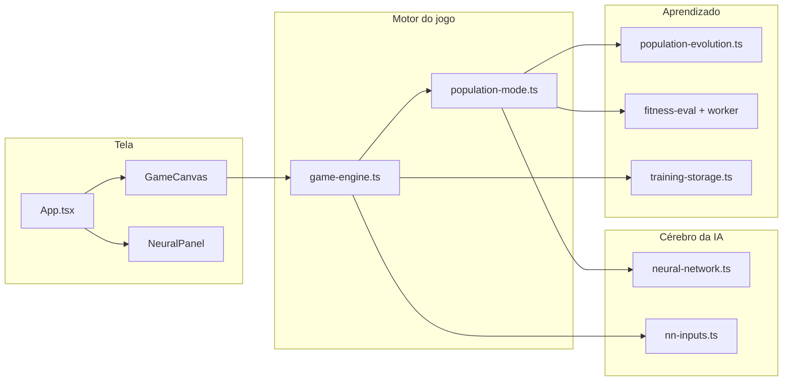

# Guia do código — Flappy Bird com IA

Este texto explica **para que serve cada parte** do projeto. Foi escrito para quem está aprendendo (ex.: adolescente) ou para quem vai mexer no código pela primeira vez.

**Stack:** React + Vite + TypeScript. O jogo roda num `<canvas>`. A IA é uma rede neural pequena treinada por **algoritmo genético** (não é ChatGPT — é evolução de pesos, estilo “sobrevivência do mais apto”).

---

## Visão geral em uma frase

```
Você vê o pássaro no canvas ← GameEngine simula física e redes
Painel à direita ← mostra o que a IA “sente”, pensa e aprende
localStorage ← guarda treino e configuração da rede
```



---

## Pastas principais

| Pasta | O que tem aqui |
|-------|----------------|
| `src/game/` | Regras do Flappy, física, colisão, motor do loop, população de pássaros-IA |
| `src/components/` | Interface React (painel, botões, gráficos) |
| `src/components/panel/` | Blocos do painel lateral (rede, progresso, evolução…) |
| `src/lib/` | Rede neural, tipos do painel, salvar no navegador, utilitários |
| `docs/` | Documentação (este arquivo e resumo para outra IA) |
| `public/img/` | Sprites (`sprite.png`) |

---

## Entrada do app

### `src/main.tsx`
Monta o React na página HTML.

### `src/App.tsx`
**“Chefe da interface.”** Junta:
- **Canvas** (jogo à esquerda)
- **NeuralPanel** (painel à direita)
- Estados: velocidade (×1/×5/×10), pausa, modo IA vs jogador, tamanho da população, arquitetura da rede
- Chama `engineRef` para limpar treino, mudar população, aplicar configuração da rede

**Truque de performance:** em velocidade ×5 ou ×10, o painel usa um “snapshot” mais leve (`slowSnapshot`) para não travar.

---

## Jogo (canvas)

### `src/components/GameCanvas.tsx`
Cria o `<canvas>` e instancia o `GameEngine`. Repassa velocidade, pausa e modo jogador para o motor.

### `src/game/constants.ts`
Números fixos: largura/altura do jogo, chão, gravidade visual.

### `src/game/collision.ts`
Detecta se o pássaro bateu no cano ou no chão (hitbox).

### `src/game/bird-sprites.ts`
Recortes do `sprite.png` para animar o pássaro.

### `src/game/player-ui-sprites.ts`
Telas de “Get ready”, game over, placar e **medalhas** no modo jogador humano.

### `src/game/nn-inputs.ts`
**O que a IA enxerga** a cada frame (números entre 0 e 1):
- **Básico (3):** distância ao cano, posição na fenda, velocidade de queda
- **Completo (5):** os 3 acima + segundo cano à frente (distância e fenda)

Não é “mapa fixo” — são medidas relativas, para funcionar com canos aleatórios.

### `src/game/game-engine.ts`
**Coração do projeto.** Responsável por:
- Loop `requestAnimationFrame` (desenhar + simular)
- Modo **jogador** (você clica / Espaço) vs modo **IA** (rede decide)
- Turbo ×1–×10 (vários passos de simulação por frame **desenhado**)
- Ao morrer todos na população: `onGenerationComplete()` → evolui → nova geração
- Hall of fame (melhor genoma histórico), recorde, gráfico de histórico
- Salvar treino no `localStorage`

**Recorde vs fitness:** o número **na tela** é a partida que você viu. O **recorde** no painel usa essa pontuação visual. O **fitness** (média em vários mapas) só escolhe quem evoluir — pode ser menor que o placar da tela.

### `src/game/population-mode.ts`
Vários pássaros ao mesmo tempo, cada um com sua rede:
- `step()` — um passo de física + decisão da rede para cada pássaro vivo
- `endGeneration()` — fim da geração: calcula fitness, evolui população, retorna estatísticas

### `src/game/fitness-eval.ts`
Simula **partidas inteiras em memória** (sem desenhar) para medir fitness em vários mapas aleatórios.

### `src/game/fitness.worker.ts` + `fitness-worker-client.ts`
Roda o fitness em **Web Worker** (outra thread) para a tela não congelar tanto no fim da geração.

### `src/lib/population-evolution.ts`
**Algoritmo genético:** ordena por pontuação, copia elites, gera filhos mutados, injeta redes aleatórias novas.

---

## Rede neural

### `src/lib/nn-config.ts`
Configuração escolhida no painel:
- Entradas 3 ou 5
- Neurônios ocultos: 4, 6, 8, 12 ou 16
- Mapas por pássaro no fim da geração: 1, 3, 5 ou 10

### `src/lib/neural-network.ts`
Rede **feedforward** com sigmoid:
- `forward()` — calcula se bate asa ou não
- `mutate()` — altera pesos aleatoriamente
- `toSnapshot()` / `loadSnapshot()` — copiar rede para salvar ou clonar

### `src/lib/nn-architecture.ts`
Atalho legado; preferir `nn-config.ts`.

### `src/lib/score.ts`
Pontuação = canos inteiros. `roundScore()` evita “meio ponto” na interface.

---

## Painel lateral (UI)

### `src/lib/panel-types.ts`
Tipos TypeScript do que o painel mostra (`PanelState`, progresso, evolução…).

### `src/components/NeuralPanel.tsx`
Layout do painel: botões IA/Jogador, velocidade, limpar treino, blocos de informação.

### `src/components/panel/AiSensesBlock.tsx`
**“O que a IA vê”** — barras de Cano, Abertura, Queda (+ Cano+1, Fenda+1 se modo completo).

### `src/components/panel/MetricBar.tsx`
Uma barra com texto de status (longe, perigoso, subindo…).

### `src/components/panel/NetworkDiagram.tsx`
Desenho SVG da rede: entradas → ocultos → saída “BATE/PARA”.

### `src/components/panel/NetworkConfigPicker.tsx`
Botões para escolher entradas, ocultos e mapas/pássaro + **Aplicar rede**.

### `src/components/panel/PopulationInput.tsx`
Quantos pássaros na população (1–5000).

### `src/components/panel/ProgressBlock.tsx` + `HistoryChart.tsx`
Gráfico de melhor pontuação por geração e recorde.

### `src/components/panel/EvolutionSection.tsx`
Detalhes do algoritmo genético (elites, mutação, estagnado…).

### `src/components/panel/PanelToasts.tsx`
Mensagens flutuantes (novo recorde, fim de geração…).

---

## Persistência (navegador)

### `src/lib/training-storage.ts`
| Chave | Conteúdo |
|-------|----------|
| `flappy-bird-nn-training` | Pesos, geração, histórico, hall of fame, arquitetura |
| `flappy-bird-nn-prefs` | Preferências da rede (mesmo sem treino longo) |

**Limpar** apaga chaves que começam com `flappy-bird`.

---

## Fluxo: uma geração de treino

1. Pássaros vivos jogam; rede decide bater asa (`population.step`).
2. Todos morrem → pausa visível (tela parada no placar).
3. Se mapas/pássaro > 1: worker simula N partidas por pássaro → **fitness**.
4. `evolvePopulation` cria próxima geração.
5. `startFreshRun` — mundo novo, pássaros no início.
6. Atualiza recorde (visual), hall, gráfico; salva no `localStorage`.

**Por que demora no fim?** Passo 3 pode ser enorme (população × mapas × milhares de frames). Não é o salvamento — é a avaliação extra.

---

## Fluxo: modo jogador

1. Você controla com clique / Espaço.
2. Rede neural **não** manda no pássaro.
3. Game over, medalhas, recorde manual no mesmo `training.recorde` opcional.

---

## Comandos úteis

```bash
npm install   # dependências
npm run dev   # desenvolvimento
npm run build # build de produção
```

---

## Onde mexer para…

| Quero… | Arquivo |
|--------|---------|
| Mudar física / gravidade | `population-mode.ts`, `constants.ts` |
| Mudar o que a IA vê | `nn-inputs.ts`, `nn-config.ts` |
| Mudar aprendizado | `population-evolution.ts`, `population-mode.ts` |
| Mudar interface | `NeuralPanel.tsx`, pastas `panel/` |
| Mudar velocidade máxima | `game-engine.ts` → `MAX_GAME_SPEED` |
| Mudar tempo de fitness | `fitness-eval.ts` → `MAX_FRAMES`, ou mapas/pássaro no painel |

---

## Leitura recomendada

1. `game-engine.ts` (loop)
2. `population-mode.ts` (muitos pássaros)
3. `neural-network.ts` (cérebro)
4. `App.tsx` + `NeuralPanel.tsx` (tela)

Documento técnico para outra IA: [`RESUMO-PARA-IA.md`](./RESUMO-PARA-IA.md).

---

## Comentários no código

Os arquivos principais em `src/` começam com um bloco `/** … */` explicando o papel do arquivo e apontando para este guia. Abra o arquivo e leia o topo antes de mergulhar no resto.
